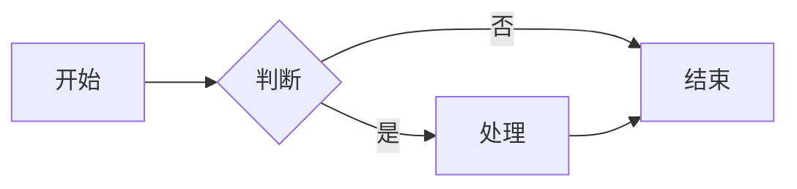

# Markdown 测试文档

这是一段普通正文，包含 **加粗**、*斜体*、`行内代码`，以及一个[链接](https://example.com)。

## 列表

- 无序项 1
- 无序项 2
  - 嵌套项
1. 有序项一
2. 有序项二

## 代码高亮

```js
function greet(name) {
  console.log(`你好, ${name}`)
  return name.length
}
```

## 表格

| 名称 | 类型 | 说明 |
|------|------|------|
| id   | int  | 主键 |
| name | str  | 名称 |
| ok   | bool | 状态 |

## 引用

> 这是一段引用文字，用来检查 blockquote 样式。

## 数学公式（KaTeX）

行内公式 $E = mc^2$，下面是块级公式：

$$\int_0^1 x^2 \, dx = \frac{1}{3}$$

## 流程图（Mermaid）



## 图片（测试占位/自适应）


---

正文结束。用顶部的 **A- / A+** 试试字体缩放。
